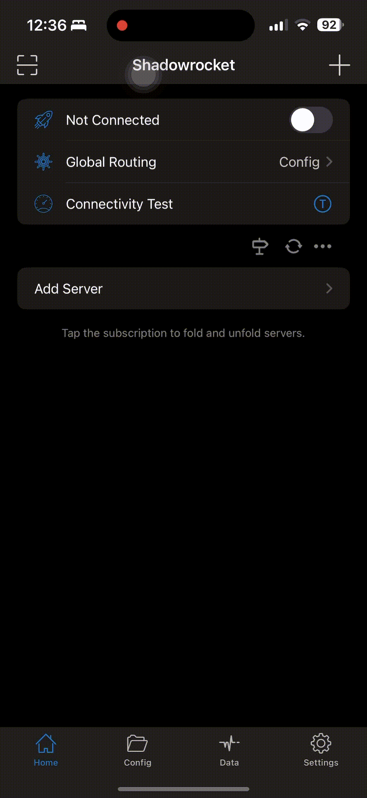
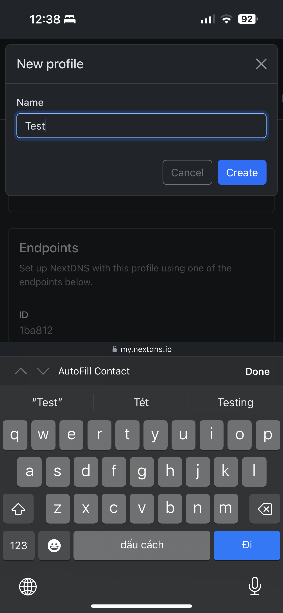
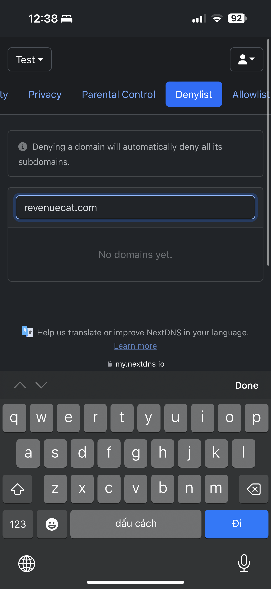
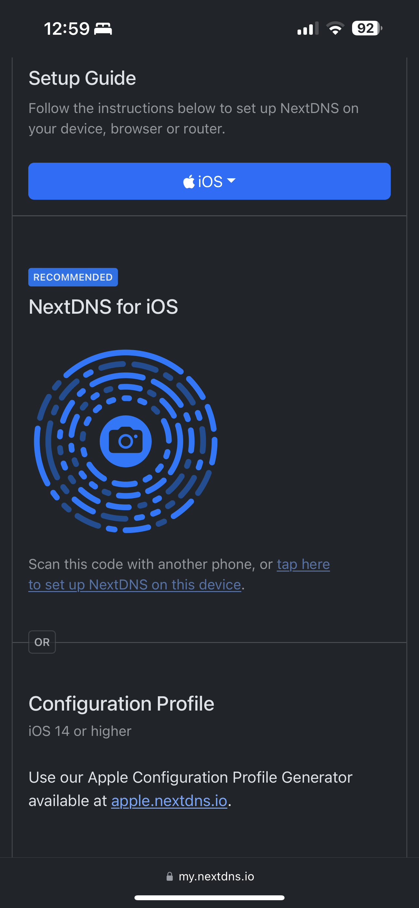

# 💛 LocketGold

<div align="center">

## Tổng quan

LocketGold là một dự án sửa đổi các phản hồi API từ ứng dụng Locket. Mục đích để giả lập các tính năng của gói thành viên "Locket Gold", cho phép người dùng trải nghiệm các chức năng dành riêng cho những người đăng ký trả phí.

</div>

## Tính năng chính

- **Giả lập tính năng "Locket Gold":** Chứa logic để thay đổi hồ sơ người dùng và thông tin tài khoản, can thiệp vào trạng thái `is_gold_member` để kích hoạt các tính năng "Gold".

## Cách sử dụng

### Qua ứng dụng quản lý proxy (Shadowrocket):

1. **Tải ứng dụng Shadowrocket**: Tải ứng dụng [Shadowrocket (99.000 VNĐ)](https://apps.apple.com/vn/app/shadowrocket/id932747118?l=vi) hoặc có thể liên hệ với tuiii để tải ứng dụng này miễn phí
2. **Thêm cấu hình**: Mở Shadowrocket và thêm cấu hình này:

```bash
https://www.dropbox.com/scl/fi/89615g69rqbusf8cg235e/LocketGold.module?rlkey=pi6o3eepj21w1n1gg1x9i0hco&st=0iezmu8r&dl=1
```

<details>
<summary>Cách thêm module vào Shadowrocket</summary>



</details>
<br>

3. **Chạy Shadowrocket**: Khởi chạy ứng dụng Shadowrocket
4. **Thành công**: Mở ứng dụng Locket kiểm tra xem đã có Gold chưa. Nếu có hãy chuyển đến bước 5.
5. **Cài đặt NextDNS**: Chặn phản hồi của Locket để không phải thực hiện lại.

<details>
<summary>📺 Hướng dẫn cài đặt NextDNS</summary>

<br>

<div style="display: flex; gap: 10px;">
  
  
  
</div>

</details>

> Nếu không biết cách cài đặt NextDNS, có thể cài trực tiếp đường dẫn này https://apple.nextdns.io/?profile=1ba812.

> Có thể tắt Shadowrocket khi đã mở khóa Gold và cài đặt thành công NextDNS.

<div align="center">

Tạo cho 😳 bởi Vu Chu

</div>
